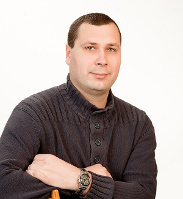

|||**VALERII LETIUK**|
| :---: | :---: | :---: |

### **PROFILE:**

Age 36 Married Kharkiv (currently moved with family to central Ukraine)

---

### **EDUCATION:**
* *O.M.Beketov National University of Urban Economy in Kharkiv* ***2005 – 2010*** **Specialist** Electrical engineer
* *National Technical University "Kharkiv Polytechnic Institute"* ***2020 – 2024*** **PhD** Applied mechanics

---

### **HARD SKILLS:** (self-education)
* HTML
* CSS
* Java Script
* ReactJS
* Git

---

### **Portfolio:** 
[ReactJS](https://github.com/NRG-Spirit/coins-ts.git) 
[HTML+CSS+JS](https://nrg-spirit.github.io/Spirit-public/)

---

### **CONTACT INFORMATION:**
**+38-099-95-123-96** 
*(viber, telegram, signal)* 
Email: spirit.nrg@outlook.com 
[LinkedIn](www.linkedin.com/in/Valerii-Letiuk) 
[GitHub](https://github.com/NRG-Spirit/Spirit-public)

---

### **WORK EXPERIENCE:**
*JSC “Ukrainian energy machines”* 
**Deputy shop manager** 
***2007–present***
* Organization of the workshop
* Introduction of new equipment 
* Introduction of new technologies and tools 
* Solving personnel issues
* Ensuring fire safety, environmental safety, requirements of labor protection rules

---

### **SPOKEN LANGUAGES:**
* English – B1 (intermediate) 
* Ukrainian – native 
* Russian - fluently 